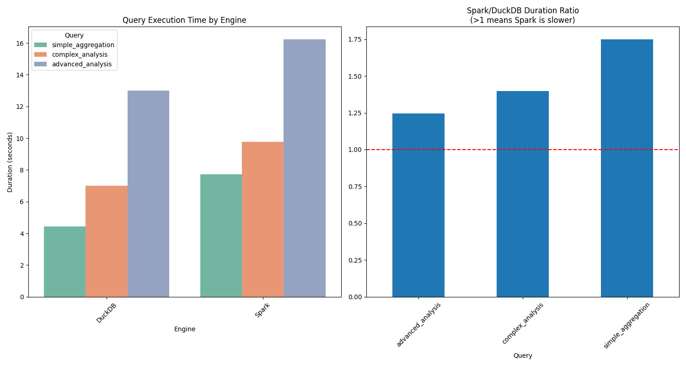
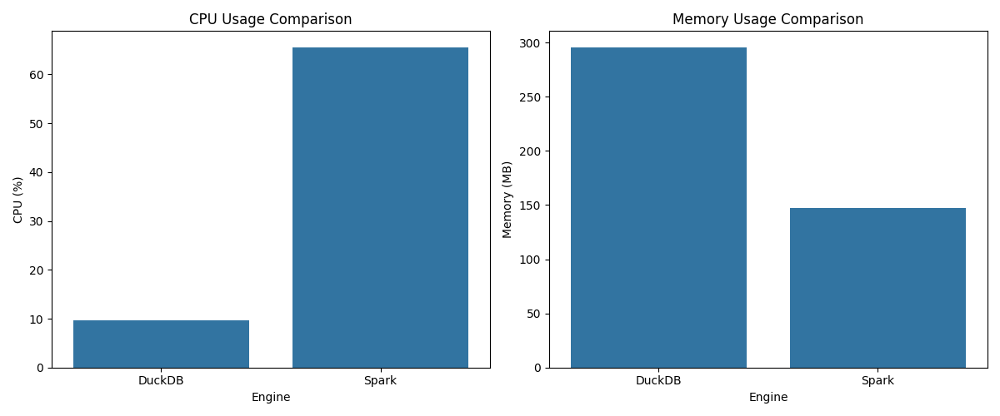

# NYC Taxi Data Analysis Benchmark Report
Generated on: 2024-12-31 14:40:06

## Environment Setup

### Docker Infrastructure
- **Required Components**:
    * Apache Spark with Iceberg support
    * REST catalog service
    * MinIO object storage
    * MinIO client for bucket setup

### Initial Setup
1. **Clone Repository and Create Directories**:
   ```bash
   git clone <repository-url>
   ```

2. **Docker Compose Environment**:
   ```yaml
   # Key services from docker-compose.yml:
   - spark-iceberg (Jupyter + Spark): ports 8888, 8080
   - rest (Iceberg REST catalog): port 8181
   - minio (Object storage): ports 9000, 9001
   - mc (MinIO client): for bucket setup
   ```

3. **Start the Environment**:
   ```bash
   docker-compose up -d
   ```

4. **Access Points**:
    - Jupyter Lab: http://localhost:8888
    - MinIO Console: http://localhost:9001
    - Iceberg REST: http://localhost:8181

## Step-by-Step Instructions

1. **Data Download and Preparation (00_download_data.ipynb)**
    - Run this notebook first to download NYC Taxi data for 2022 and 2023
    - The notebook will:
        * Create a data directory
        * Download Parquet files for each month
        * Verify downloaded files
        * Display data preview and statistics
    - Expected runtime: ~30 minutes depending on network speed
    - Total data size: ~1.2GB (2 years of data)

2. **Data Ingestion to Iceberg (01_data_ingestion.ipynb)**
    - Loads the downloaded Parquet files into Apache Iceberg
    - Creates a properly partitioned table structure
    - Includes data validation steps
    - Key configurations:
      ```python
      DATABASE_NAME = "nyc"
      TABLE_NAME = "taxis"
      PARTITION_BY = "days(tpep_pickup_datetime)"
      ```
    - Expected runtime: ~45 minutes
    - Key operations:
        * Iceberg table creation with optimized settings
        * Batch loading of monthly files
        * Partition by pickup date for query optimization

3. **DuckDB Analysis (02_duckdb_analysis.ipynb)**
    - Performs benchmark queries using DuckDB
    - Connects to Iceberg tables
    - Executes simple and complex analysis
    - Records performance metrics
    - Expected runtime: ~10 minutes

4. **Spark Analysis (03_spark_analysis.ipynb)**
    - Similar analysis using Apache Spark
    - Provides comparison point for DuckDB
    - Uses same queries for fair comparison
    - Expected runtime: ~15 minutes

5. **Benchmark Comparison (04_benchmark_comparison.ipynb)**
    - Generates visualizations and comparisons
    - Creates this comprehensive report
    - Analyzes performance differences
    - Expected runtime: ~5 minutes

## Container Architecture
```
┌─────────────────┐    ┌──────────────┐
│  Spark-Iceberg  │◄───┤ Iceberg REST │
│  (Processing)   │    │   Catalog    │
└────────┬────────┘    └──────┬───────┘
         │                    │
         │                    │
         ▼                    ▼
┌─────────────────┐    ┌──────────────┐
│     MinIO       │◄───┤  MinIO Client │
│ (Object Store)  │    │ (Setup/Admin) │
└─────────────────┘    └──────────────┘
```

## Dataset Context
- **Dataset**: NYC Yellow Taxi Trip Records 2022-2023
- **Size**: ~80 million records (~1.2GB Compressed)
- **Source**: NYC Taxi & Limousine Commission (TLC)
- **Storage Format**: Apache Iceberg (Parquet files)
- **Partitioning**: By days(tpep_pickup_datetime)
- **Data Fields**: 19 columns including timestamps, locations, payment info, and trip metrics

## Query Definitions

### Simple Aggregation Query
```sql
SELECT
    COUNT(*) AS total_records,
    AVG(trip_distance) AS avg_trip_distance,
    MAX(total_amount) AS max_total_amount,
    MIN(fare_amount) AS min_fare_amount
FROM nyc_taxis
```
**Purpose**: Basic statistics about taxi trips including total count, average distance, and fare extremes.

**Complexity Factors**:
- Full table scan required
- Multiple aggregation functions
- Numeric computations

### Complex Analysis Query
```sql
SELECT
    payment_type,
    COUNT(*) AS trip_count,
    AVG(total_amount) AS avg_total_amount,
    MAX(tip_amount) AS max_tip_amount,
    SUM(CASE WHEN passenger_count > 1 THEN 1 ELSE 0 END) as shared_rides
FROM nyc_taxis
WHERE trip_distance > 2 AND total_amount > 0
GROUP BY payment_type
ORDER BY trip_count DESC
```
**Purpose**: Advanced analysis of payment patterns with multiple derived metrics

**Complexity Factors**:
- Filtering conditions
- Grouped aggregations
- Conditional counting
- Sorting of results

### Advanced Analysis Query
```sql
SELECT 
    DATE_TRUNC('month', tpep_pickup_datetime) AS month,
    payment_type,
    ROUND(AVG(fare_amount), 2) AS avg_base_fare,
    ROUND(AVG(total_amount), 2) AS avg_total_fare,
    ROUND(AVG(total_amount - fare_amount), 2) AS interpolated_tip,
    COUNT(*) AS num_rides,
    ROUND(STDDEV(total_amount), 2) AS fare_stddev,
    ROUND(AVG(total_amount) - LAG(AVG(total_amount)) OVER (PARTITION BY payment_type ORDER BY DATE_TRUNC('month', tpep_pickup_datetime)), 2) AS fare_change,
    ROUND(100 * (AVG(total_amount) - LAG(AVG(total_amount)) OVER (PARTITION BY payment_type ORDER BY DATE_TRUNC('month', tpep_pickup_datetime))) / LAG(AVG(total_amount)) OVER (PARTITION BY payment_type ORDER BY DATE_TRUNC('month', tpep_pickup_datetime)), 2) AS fare_change_pct,
    CASE
        WHEN 100 * (AVG(total_amount) - LAG(AVG(total_amount)) OVER (PARTITION BY payment_type ORDER BY DATE_TRUNC('month', tpep_pickup_datetime))) / LAG(AVG(total_amount)) OVER (PARTITION BY payment_type ORDER BY DATE_TRUNC('month', tpep_pickup_datetime)) < -20 THEN 'Strong Decrease'
        WHEN 100 * (AVG(total_amount) - LAG(AVG(total_amount)) OVER (PARTITION BY payment_type ORDER BY DATE_TRUNC('month', tpep_pickup_datetime))) / LAG(AVG(total_amount)) OVER (PARTITION BY payment_type ORDER BY DATE_TRUNC('month', tpep_pickup_datetime)) < -5 THEN 'Decrease'
        WHEN 100 * (AVG(total_amount) - LAG(AVG(total_amount)) OVER (PARTITION BY payment_type ORDER BY DATE_TRUNC('month', tpep_pickup_datetime))) / LAG(AVG(total_amount)) OVER (PARTITION BY payment_type ORDER BY DATE_TRUNC('month', tpep_pickup_datetime)) < 5 THEN 'No Change'
        WHEN 100 * (AVG(total_amount) - LAG(AVG(total_amount)) OVER (PARTITION BY payment_type ORDER BY DATE_TRUNC('month', tpep_pickup_datetime))) / LAG(AVG(total_amount)) OVER (PARTITION BY payment_type ORDER BY DATE_TRUNC('month', tpep_pickup_datetime)) < 20 THEN 'Increase' 
        ELSE 'Strong Increase'
    END AS trend_category
FROM nyc_taxis
GROUP BY payment_type, DATE_TRUNC('month', tpep_pickup_datetime)
```
**Purpose**: Trend analysis over monthly periods with categorization of percent changes

**Complexity Factors**:
- Date truncation and grouping
- Windowed functions for previous month comparisons
- Multiple levels of aggregation
- Complex CASE statement for trend labeling
- Many derived metrics

## Performance Results

### Query Execution Times
|    | Engine   | Query              |   Duration (seconds) |   Row Count |
|---:|:---------|:-------------------|---------------------:|------------:|
|  0 | DuckDB   | simple_aggregation |              4.42237 |    77966324 |
|  1 | DuckDB   | complex_analysis   |              6.98817 |    35255440 |
|  2 | DuckDB   | advanced_analysis  |             13.0147  |    77301055 |
|  3 | Spark    | simple_aggregation |              7.73131 |    77966324 |
|  4 | Spark    | complex_analysis   |              9.7595  |    35255440 |
|  5 | Spark    | advanced_analysis  |             16.2244  |    77301055 |

### Resource Usage
| Engine | Peak CPU % | Memory (MB) |
|--------|------------|-------------|
| DuckDB | 9.7 | 296 |
| Spark  | 65.6 | 147 |

## Performance Analysis

### Query Performance
- Fastest simple query: 4.42s (0)
- Fastest complex query: 6.99s (1)
- Fastest advanced query: 13.01s (2)
- DuckDB average time: 8.14s
- Spark average time: 11.24s
- Speed ratio (Spark/DuckDB): 1.38x


## Recommendations

- For single-node analytical tasks or use cases with limited computational resources, DuckDB is the clear winner.
- For distributed processing or scenarios where memory constraints outweigh CPU efficiency, Spark may still be preferred despite slower query times.


## Visual Comparisons
### Performance Comparison


### Resource Usage



## Summary
DuckDB outperforms Spark in query execution times across all query types, with an average speed advantage of 1.38x. 
It excels particularly in simple aggregation tasks, where it is 1.75x faster than Spark. 
However, DuckDB's efficiency comes with a trade-off: while it uses significantly less CPU (9.7% vs. Spark’s 65.6%), 
its memory usage is double that of Spark (296 MB vs. 147 MB). 
These differences make DuckDB ideal for single-node analytical tasks with limited computational resources, 
while Spark remains suitable for distributed environments or memory-sensitive workloads. 
Despite its strengths, DuckDB faces limitations in Iceberg table handling, particularly in locating the `version-hint.txt` file. 
To address this, i developed a custom function that determines the latest metadata version directly, 
enabling seamless integration with Iceberg. This workaround resolves a critical issue even when using the latest DuckDB version ( [GitHub Issue #21](https://github.com/duckdb/duckdb-iceberg/issues/21) ). 
While DuckDB's speed and CPU efficiency make it a strong choice for local analytics, improving its Iceberg compatibility would enhance its applicability in broader data processing workflows.

## Resources
- Complete benchmark code available in repository
- Raw performance data in JSON files
- Configuration files in docker-compose.yml
- Visualization outputs in PNG format
